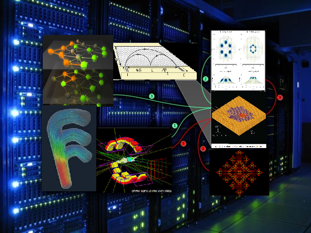

# Course description

The _Scientific Modelling Computer Lab_ is a project-based course aimed at last yeargroups of the Master in Physics program. It is assumed, that the students have knowledge of basic programming, data visualization, exploration and advanced statistical methods.

The semester is going to consist of one project. Students work individually based on the recommended readings and materials. There is a possibility of contacting the lecturer and the project leader for help. For each lab meeting, students have to create a progress report and upload it to the course website in [Moodle](https://moodle.elte.hu/course/view.php?id=21135). The deadlines are set on a weekly basis to encurage continuous work. 

Besides the weekly reports, one review report should be submitted at the middle of the semester and one final report at the end of the semester.

Requirements of the reports and the grading system is decribed below. These guidelines for the final report are quite similar to that of a journal submission, and they are designed to give students some foundations also in academic writing and the presentation of their own results. Hints for the progress reports are according to
scientific project reports. Nowadays, most scientists and employees are working supported from various projects with strict deadlines and reviews. The midterm/weekly reports prepare students
for appropriate time management and consize presentation of results about they work in progress. Such reports are helpful for collecting feedback, showcasing problems and discussing possible
workarounds.

Students are encouraged to sumbit their work in LaTeX. An example LaTeX file bundle is given ([LaTeX template](template.tex), [references in BibTex](sample.bib), [sample figure](ising.png), [resulting pdf](template.pdf)). You can easily prepare your document using online latex editors like overleaf or jupyterlab at [kooplex-edu](https://kooplex-edu.elte.hu/notebook/crrd9e-tudmodlab/lab). Working with latex on kooplex-edu requires activating TeX and LaTeX related Nbextensions. 

At the end of the course, there will be a mini-conference from these presentations with space for thoughts and questions.

## Report and Presentation Guidelines (weekly, midterm and final)

These are the guidelines that will be considered when grading your assignments. We strongly advise you to follow them not only to get better grades, but because they are pretty close to what a scientific article submission requires. If you prepare your assignments adhering to these guidelines, you are going to have a reasonable template for your thesis and first articles etc.

The weights of the elements for the grading are included at the end of the file.

### General requirements

Submit all text files to the github repository of the lab both in source code and in pdf format. Attach your code as well, but do not include external libraries and frameworks. If you have used any other sources than yours, list them in the references section of your report.

Do not use capital letters, spaces, accents or any special characters but _ in your filenames!

Upload these files into the *_github subfolder_* of your project. If more students are working on the same project, there are dedicated subfolders for each of them. 

### Cover letter (only for the midterm and final)

Write a short cover letter when submitting your work and upload it into [moodle](https://moodle.elte.hu/course/view.php?id=21135). It has to be concise, but include keywords like the title of the course and the title of your project. It should be in a letter form with your name, the address of the university, salutation and closing. Write a short summary about your work: what are the 2-3 most important results/conclusions what you have learned and what can be interesing for an external reader. Summarize shortly the list of files, what you have uploaded to the github repository. 

An average cover letter is a half din A4 page long, but it never should be longer than one page with all formal parts.

## Project report

### Content

#### Motivation.

Please try to introduce your subject in a way that raises interest. It does not suffice only to state that this was a school project assignment, maybe it helps if you think about what intrigued you most in the assignment. If you have no better idea, you can write about what motivated others when they were thinking about the problem. Try to think as if you were the reader, who has to read several assignments (articles) in a row, and you would like to hook his or her attention.

#### Introduction and theoretical background.

Try to place your project work in a broader context to help the reader evoke his or her connotations and former knowledge on your subject. Write as if the reader had only superficial knowledge of the area, and keep in mind that even if the reader is an expert, it is most likely that at the time of the writing you have spent much more time with your subject than he or she has. Your text should be self-contained, that is, it has to be coherent in a way that the reader does not necessarily have to turn to other resources in order to roughly understand your subject.

Always include ideas and formulas that you are going to test in your work, and explain the notations you use. Explain briefly your methods. Even if they are widely known, explain your choice in a sentence, but do not discuss in detail (only if you added some new elements to the implementation, but then, the method in itself will be part of your work), cite further resources, if necessary.

#### Emphasize your contribution.

You should make it clear what your own contribution was. Even if you work on known/solved problems, as in the case of assignments, write about the ideas and questions you had concerning your simulations, and emphasize how you tested these ideas or what part of your own work answered those questions. If up to some point, the work was done by somebody else (e.g. you contributed to/experimented with a larger open-source/open data project), explain again, what you added to the work done by others.

#### Discussion.

The most important part of your work is when you present your results, and you evaluate whether they fit into your expectations or not. Below, we present our most important questions, think of them while writing!

* Is it the number/function/behaviour that is in the literature? Is it what you expected? If yes, please underline that your results are in accordance with the theoretical/literature/expected/experimental behaviour, values, functions. Clearly reference the appropriate literature. Discuss any errors.

*    If not, then why not? Could you think of methods with that you could improve your results? You don’t have to implement them, only think about it)!

*    Are you sure that you did not underestimate your error? How did you estimate your errors?

*    Can you reach the limits of your model, or the limits of your computer? Try to discuss scenarios, when your algorithm fails! What is the role of numerical error in your work? Does this influence your results? Experiment and play with your simulation/data, it is (as opposed to real experiments) costless!

*    What has been difficult to realize? What are the pros and cons of the methods you used?

*    Present measurable quantities, if there are several parameters of your model, explore the parameter space, demonstrate the fundamentally different behaviours!

#### Conclusion.

Please wrap up your work at the end of the assignment, again, underline your own contribution, state the main results. It helps the reader to summarize and to see what you wanted to emphasize.

### Format

#### PDF

You can write your assignment with your favourite text processing engine (Word, Latex, Jupyter Notebook etc.), as long as you submit your work in one single PDF file that contains all of your figures, text and tables. However, it should not contain your code! Think of your code as your lab experiment, and your project work as your research article. You should of course upload to the github folder of your project all your Jupyter Notebook or knitR document or any other source code you have written as a separate file. Note again, only codeless PDF reports will be graded.

If you have problems exporting your Jupyter Notebook directly to PDF, or exporting it without code, check out nbconvert’s option to convert it to tex, then format it in your favourite tex editor, and compile to PDF.

#### Sectioning.

A good header containing your name, the date and the title of the project always helps. Even if you don’t make any headers, you should include an article-like title section with at least the project title, the course name, your own name and the actual date.

Make a reasonable division of your work by using section and subsection headers. Make sure that the margin, font choice and the font size provide the reader with maximum readability. Pay attention to page breaks, paragraph and line spacing, remain moderate in formatting.

#### Language.

You have to submit everything (e.g. comments in your code!) in English, as it is the language of the scientific world. It is a good occasion to practice. 
Pay attention to orthography and your choice of words! Use a spell-checker: it removes most of the annoying mistakes. Have your document proof-read, if you are not sure in your own skills! Wrong spelling can make the understanding and the interest of the reader decay with a remarkably short half-life.

Remain objective and concise. Do not use very long sentences, pay attention to using the special terminology of your subject.

#### Figures

All figures must have a numbering and a short caption describing the content. Figures are the first objects a reader skims through after the introduction. The captions and the legend should provide enough information to understand the content of your figure. If you refer to the figures in your text, use the numbering you introduced.

If possible, include vector graphics in your work (PDF, SVG, EPS). It is going to pay off when preparing the presentation, where you have to magnify them to a large scale.

Pay attention to line width, the color choice, axis title, tick label and legend font sizes. They all have to be easily readable both in your paper and in your presentations. It may happen that you have to prepare your figures a little differently to the screen for the presentation: paper aspect ratios and sizes are not the same as the slides may require.

Always write axis titles with units, and clear legends that explain colors, lines and markers on your figure.

Minimize figure margins, padding and whitespace in them.

If possible, have a consistent color scheme across all figures. Especially when simulation runs or different experiments are shown through different measurements or parameters, colors must remain consistent.

### References

All external sources must be indicated in the text, and listed in a reference list below the document. In Latex, using BibTeX is the most convenient way to produce this output. Most reference management softwares provide BibTeX support: the easiest way is to collect the articles or web pages you use as sources during your working phase in Mendeley (free), EndNote (free academic account is available), Zotero (free), KBibTex (free) or other reference managers, and then let LaTeX handle your citations in the default manner.

Documents without references will not be accepted: it is simply not possible that you worked without sources. We strongly encourage you to try to read or use some parts of original research articles.

When using notebooks or other commented source codes for presenting your results, provide the appropriate URL, which points to the repository (github, kooplex-edu etc), where your code and
results can be immediately seen after clicking on the link.

## Presentation

Every week, you have to discuss your progress with your project leader. The best way to do this, is to create a short presentation. Furthermore, at the mid and at the end of the course, you will have to prepare a ten minute presentation from your assignment. Below are some points to pay attention to when preparing your presentation.

#### Time limit.

Take the time limit seriously. After ten minutes, your presentation will be stopped, and you will be allowed only two more sentences. A good rule of the thumb is to prepare as many informative slides (apart from the title slide and the last one thanking the attention) as minutes. The introduction, motivation, discussion and conclusion parts must all fit into these ten minutes! Think about your main and most interesting results, thread them up into a good storyline for the presentation.

#### Formatting.

For the preparation of figures, refer to the previous section. It is always a good choice if your beamer template is in harmony with your figure colors. Have a consistent template (colors, elements, fonts etc.) across all slides, but be moderate in your choice as it is a scientific presentation.

Prepare a header and/or footer that contains at least your name, the presentation title and the slide number. Do not let any text or figures overlap with your template or title elements. All slides should have a title.

Place as little text on your slides as possible. Only key terms, ideas and formulas that you tested are necessary. Text is only a tool to focus and guide your audience’s attention, but you’ll explain everything not written there anyway.

When using notebooks or other commented source codes for presenting your results, provide the appropriate URL, which points to the repository (github, kooplex-edu etc), where your code and
results can be immediately seen after clicking on the link.

Always upload your work to the [moodle](https://moodle.elte.hu/course/view.php?id=21135) system.

#### Deadlines

The deadlines by which project reports must be sent in will be presented in Moodle. Take them seriously. You will have a deadline for each week, so you will be used to upload your report in time, when the time comes for sending in the midterm and the final report.

Weekly reports will be presented during the lab meetings. Presentations of mid term progress reports are due in 7. meeting (announced in Moodle), and we close the semester with the 
presentations of the final reports. 

# Grading

During the semester, there will be 10 weekly reports, each of them are worth 2 points. The mid term progress report and the final report are worth of 20 points both.
Mid term and final presentations are 20 and 20 points.

## Algorithm of your grade

Grading will happen on a basis of 100 or 98 points depending on number of lab meetings (see [grading sheet](grading.ods)).

| Points | Final grade |
|--------|-------------|
| 75-100 |	5 |
| 55-74 |	4 |
| 41-54 |	3 |
| 25-40 |	2 |
| 0-24  |	1 |

### Weekly report and presentation

| Total points per week: | 2 |
|---------------|---|
|	report | 1 |
| presentation | 1 |

### Final and mid term project report

| Total points for format: | 6 |
|------------------------|---|
|	figures  	|3 |
|	ortography	|1 |
|	style 		|1 |
|	outlook 	|1 |

| Total points for content: |14|
|	--------------------|---|
|		motivation, introduction, theory |	3|
|		discussion 	|3|
|		cover letter 	|3|
|		emphasizing own contribution| 	1|
| creativity: |4|
	
### Final and mid term project presentation

|Total points for style: |10    |
|-----------------------|---------|
|contacting the audience  speaking techniques  self-confidence 	 self-presentation 	 	body language, voice 	|4 |
|slides 	|4|
|	timing 	|2|

|Total points for content: |  10|
|-------------------------|------|
|		motivation 	|1|
|		emphasizing own work |	3|
|		structure, storyline |	3|
|guidance through the essentials 	 		not lost in details 	| 3 |
		

### Minimum requirements.

The project reports are only acceptable, if the Form section has a minimum of 3, the Content section a minimum of 6 points. If these requirements are not met, that is worth 0 points for that report.

## Additional guidelines for midterm presentation and weekly reports/presentations

The same rules apply for these type of presentations as for the final one. The only difference is, that you have no final results yet, instead, you should present your progress,
summarize your problems (if any), and sketch your plans for the next period. Starting with presenting your full time schedule is a good idea, where you can point out, whether your work
is in time, behind or before as expected. Presenting the conclusions of your discussions with your lecturer or lessons learned from any literature are also helpful. Of course,
a short summary of your new results are the most important!

## Training for online conferences and discussions 

Nowadays, online meetings and conferences are becoming more common. Some times your advisor will be present at your weekly report not personally, instead, by using an online conference tool. Save the following URL for this course: https://meet.google.com/bif-hydi-hbm, this will be always active during the lab meetings and you have to talk to your advisor and present your report through this channel.

# Course Summary:

* Atomic physics

   * [Molecular Dynamics](../MolecularDynamics) project (Dávid Visontai)
   * [hoomd_blue (not in 2021)](../hoomd_blue) project (István Csabai, Gábor Rácz)

* Astrophysics

   * [cosmology n body](../cosmology_n_body) project (István Csabai, Gábor Rácz)

* Hydrodynamics

   * [hydrodynamics](../hydrodynamics) project (István Csabai, András Biricz)

* Statistical Physics, Network science

   * [networx](../networx) project (Gergely Palla)
   * [time evolving networks](../time_evolving_networks) project (Péter Pollner)
   * [cellular automaton (not in 2021)](../cell_automata) project  (István Csabai, Péter Pollner)

* Nuclear physics

   * [geant4](../nuclear_physics_geant4) project (Ákos Horváth)

* Materials science

   * [ML in materials science](../sdddst) project (Gábor Péterffy, Péter Ispánovity)

* Particle physics

   * [HiggsSimulation (not in 2021)](../HiggsSimulation/HiggsSimulation.md) project (Gabriella Pásztor)

* Solid state physics:
   * [pybinding](../pybinding) project (László Oroszlány)

