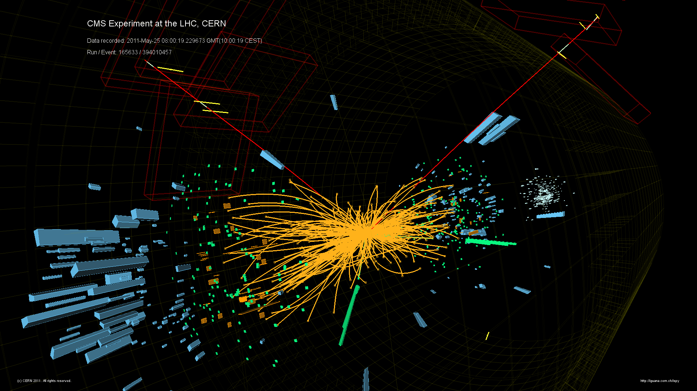
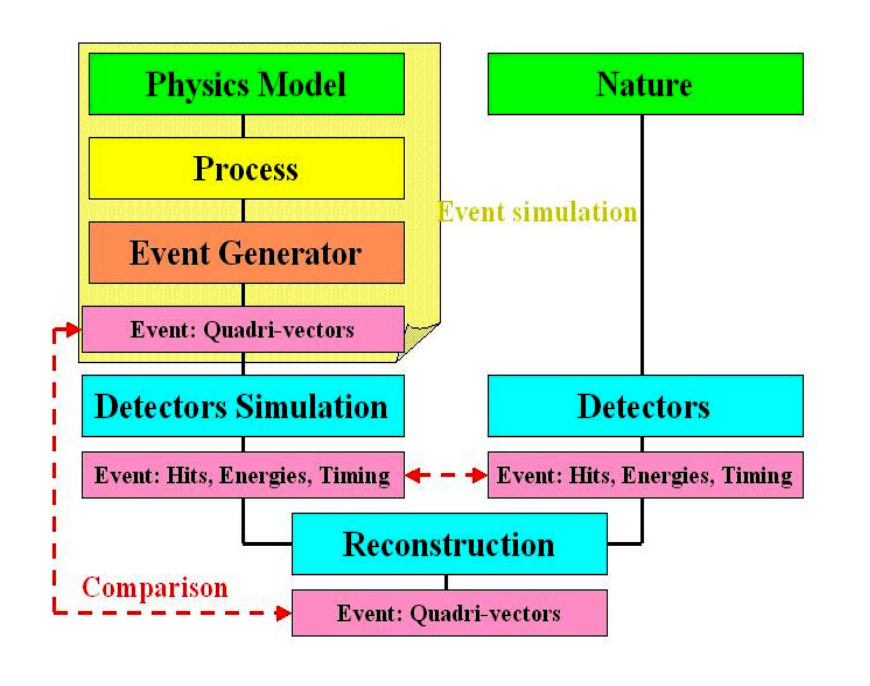
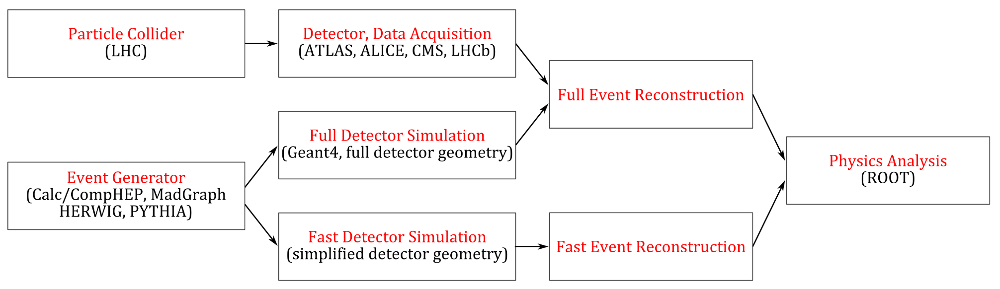
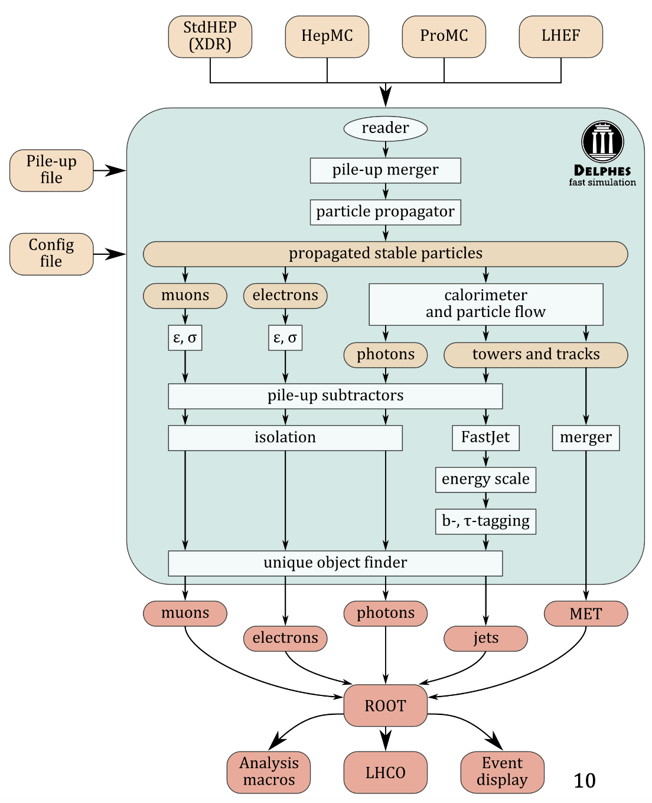
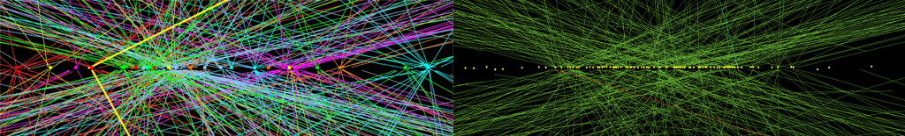
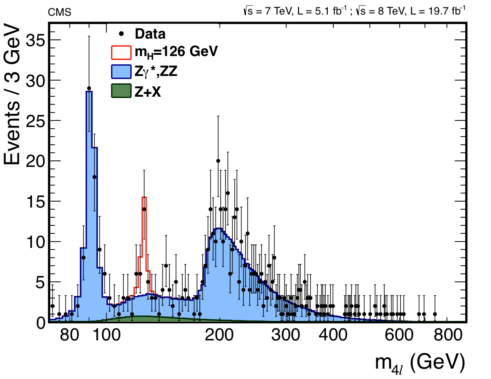

# HiggsModelling

## Higgs boson production at the Large Hadron Collider at CERN

### Introduction

In the Standard Model (SM) of particle physics elementary particles gain mass via the Brout-Englert-Higgs (BEH) mechanism, which predicts the existence of a physical scalar particle, the Higgs boson. The Higgs boson was discovered in 2012 by the ATLAS and CMS collaborations [1], leading to the award of the Nobel Prize to the theoretical physicists, Profs. Higgs and Englert. The study of the Higgs boson is one of the main pillars of the physics program at the Large Hadron Collider (LHC) to date as it opens a new window to discover new physics and the more fundamental theory behind the SM.

Aim of the project: Simulate [2,3] Higgs boson production and its main backgrounds at LHC. Find the Higgs boson signal in the simulated LHC data using machine learning methods.

---

### Software packages

**MADGRAPH**   
MadGraph5_aMC@NLO is a framework to simulate Standard Model (SM) and New Physics (NP) processes at leading order and in the case of QCD corrections to SM processes at next-to-leading order accuracy. Matrix elements at the tree- and one-loop-level can also be obtained. MadGraph5_aMC@NLO aims at providing all the elements necessary for SM and NP phenomenology, such as the computations of cross sections, the generation of hard events and their matching with event generators, and the use of a variety of tools relevant to event manipulation and analysis.  
  * http://madgraph.phys.ucl.ac.be/
  * Tutorial: https://indico.cern.ch/event/555228/sessions/203428/attachments/1315471/1970459/tutorial-CMSandATLAS-2016.pdf
  * Higgs project: https://cp3.irmp.ucl.ac.be/projects/madgraph/wiki/HiggsPheno

**PYTHIA**. 
PYTHIA is a program for the generation of high-energy physics events, i.e. for the description of collisions at high energies between elementary particles such as e+, e-, p and pbar in various combinations. It contains theory and models for a number of physics aspects, including hard and soft interactions, parton distributions, initial- and final-state parton showers, multiparton interactions, fragmentation and decay.  
   * http://home.thep.lu.se/Pythia/

**DELPHES**  
Delphes is a C++ framework, performing a fast multipurpose detector response simulation. The simulation includes a tracking system, embedded into a magnetic field, calorimeters and a muon system. The framework is interfaced to standard generator output file formats (e.g. Les Houches Event File or HepMC) and outputs observables such as isolated leptons, missing transverse energy and collection of jets which can be used for dedicated analyses. The simulation of the detector response takes into account the effect of magnetic field, the granularity of the calorimeters and sub-detector resolutions. Visualisation of the final state particles is also built-in using the corresponding ROOT library.  
   * https://cp3.irmp.ucl.ac.be/projects/delphes

**ROOT**  
Root is a modular scientific software toolkit. It provides all the functionalities needed to deal with big data processing, statistical analysis, visualisation and storage. It is mainly written in C++ but integrated with other languages such as Python and R.  
   * https://root.cern.ch/

**TMVA**  
The Toolkit for Multivariate Data Analysis with ROOT (TMVA) is a ROOT-integrated project providing a machine learning environment for the processing and evaluation of multivariate classification, both binary and multi class, and regression techniques targeting applications in high-energy physics.  
   * https://root.cern.ch/tmva
   
---

### Project plan

**Step 1:**  
Install Madgraph  
Generate pp --> H signal events with different configurations (LO, NLO, ...) and via different production processes

**Step 2:**  
Install ROOT  
Compare Higgs kinematic properties

**Step 3:**  
Generate main background processes pp --> ZZ, tt, Z+jets, ...  
(takes 5 mins to generate 10K events of pp->tt~ process)

**Step 4:**  
Install Pythia to hadronize the generated 4-vectors  
Interface the Madgraph output to Pythia

**Step 5:**  
Install DELPHES  
Apply parametric "fast" detector simulation on Pythia output  
Visualise a few events with DELPHES 
Compare true and smeared variables 

**Step 6:**  
Add pile-up generated by Pythia8 with DELPHES  
ATLAS note on pileup simulation:  
[http://iopscience.iop.org/article/10.1088/1742-6596/513/2/022024/pdf][link1]  
See also "Soft QCD processes" in Pythia8 Manual:  
[http://home.thep.lu.se/~torbjorn/pythia81html/Welcome.html][link2]  

  [link1]: http://iopscience.iop.org/article/10.1088/1742-6596/513/2/022024/pdf
  [link2]: http://home.thep.lu.se/~torbjorn/pythia81html/Welcome.html

**Step 7:**   
Install TMVA, study kinematic variables to differentiate between signal and background processes  

**Step 8:**   
Compare signal/background for different MVA methods and simple cut-based selection   

---

### References

[1] The CMS Collaboration,
A New Boson with a Mass of 125 GeV Observed with the CMS Experiment at the Large Hadron Collider, DOI: 10.1126/science.1230816,   
http://science.sciencemag.org/content/338/6114/1569/tab-pdf  

[2] Computational particle physics for event generators and data analysis  
https://iopscience.iop.org/article/10.1088/1742-6596/454/1/012051/pdf

[3] Introductory but detailed lecture on Monte Carlo simulations from the last MCNet school:  
https://indico.desy.de/indico/event/19968/contribution/2/material/slides/0.pdf  
https://indico.desy.de/indico/event/19968/contribution/5/material/slides/0.pdf  
https://indico.desy.de/indico/event/19968/contribution/10/material/slides/0.pdf  

---

### Contact

Gabriella.Pasztor@ttk.elte.hu  
Ruchi.Chudasama@cern.ch  
