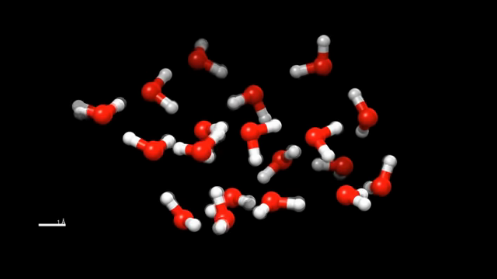

## Classical Molecular Dynamics (MD) Simulation with LAMMPS

Simulating the dynamics of atoms, molecules and bulk materials can be done on many length scales with more or less detailed models. In this tutorial we treat the atoms as point particles and describe their interactions classically. There are many software packages for molecular dynamics, such as DLPOLY, GROMACS, AMBER, NAMD, HOOMD etc. A chosen time integrator algorithm will calculate the forces acting on each atom and moves them by a predefined timestep. This way we can observe the dynamics of a couple of thousand of atoms. From these simulations we will be able to calculate statistical averages of physical quantities, potential energy surfaces, diffusion constants, phonon dispersions and so on.

I recommend to use LAMMPS for this project https://lammps.sandia.gov/. It easy to setup and one of the popular options.

In order to run the simulations we will need to use forcefield parameters. Shipped with the LAMMPS source code there is a `potentials` directory, which contains forcefield parameters for various element types for different models. I recommend using the **REAXFF** forcefield parameters or a **Lennard-Jones** type potential with charges.

#### Description of the task:
The following paper by Zhang et al. describes a classical molecular dynamics type of calculation of the $Na^+$ - $F^-$ ion pair distance in aqueos solution. Try to calculate/simualte the quantities which appear in the paper!
[Link to the paper](https://www.sciencedirect.com/science/article/abs/pii/S0378381220301618)

Try to visualize the movements of atoms as well! You can use VMD[https://www.ks.uiuc.edu/Research/vmd/], (Paraview)[https://www.paraview.org/], (VisIt)[https://wci.llnl.gov/simulation/computer-codes/visit/], (Avogadro)[https://avogadro.cc/] or any other softwares.

For validating the model on the way:
* https://www.ncbi.nlm.nih.gov/pmc/articles/PMC6175054/
* https://www.researchgate.net/profile/Ashu_Choudhary4/post/Can_anybody_guide_me_to_calculate_Spatial_distribution_function/attachment/59d622726cda7b8083a1c262/AS%3A273533098233860%401442226780198/download/JChemPhys_99_3049.pdf

[] https://www.isis.stfc.ac.uk/Pages/md-lecture-1.pdf
