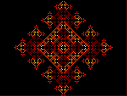
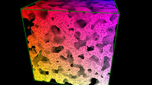

# Cellular automata
## Note: this project is flexible, the new aim of this project is to develop a cell automaton based epidemic model

 

A cellular automaton is a collection of "colored" cells on a grid of specified shape that evolves through a number of discrete time steps according to a set of rules based on the states of neighboring cells. The rules are then applied iteratively for as many time steps as desired. von Neumann was one of the first people to consider such a model, and incorporated a cellular model into his "universal constructor." The theory of cellular automata is immensely rich, with simple rules and structures being capable of producing a great variety of unexpected behaviors. It has even been proved by Gacs (2001) that there exist fault-tolerant universal cellular automata, whose ability to simulate other cellular automata is not hindered by random perturbations provided that such perturbations are sufficiently sparse. [(mathworld)](http://mathworld.wolfram.com/CellularAutomaton.html) In this project you can enjoy the simplicity of cellular automata by
applying them in any fields of physics.

## Proposed steps for the project

1.    Investigate different methods for assigning 1-dimensional, 2 state elementary cellular automata into the four categories defined by S. Wolfram:
        For a basic assessment, generate all 256 rules and investigate their behavior visually. (The PDF report should contain only a few interesting figures.)
        Calculate the fractal dimension and the entropy in both space and time.
        Calculate λ, defined by C. Langton.
    For all four categories, choose a few cells for a few rules and measure the power spectral density.

2. Implement the following basic 2D model for the spread of disease, using Moore neighborhood:

    Possible states of the cells: 
        0 - empty, 
        1 - healthy, but susceptible to disease, 
        2 - infected, 
        3 - recovered, immune to the disease.
        
    Dynamical rules:
* Empty cells remain empty.
*  A healthy cell becomes diseased if 2 or more of its neighbors are infected.
*  An infected cell recovers if 4 or less of its neighbors are infected.
*  A recovered cell is no longer susceptible to the disease.

   Variable parameters of the system:
*  The initial p_0 probability that a given cell is not empty. (Thus a cell is empty with probability 1-p_0.)
*  The initial p_i probability that a non-empty cell is infected.

   Study the system using the following guidelines:
* Investigate the complexity of the system (by one of the complexity measures defined above) as a function of initial parameter values.
* Investigate the similarities between the final states of the system. (For example, by measuring their [mutual information](https://en.wikipedia.org/wiki/Mutual_information).)
* Investigate the total number of infected cells throughout the spread of the disease and the time it takes to reach a stationary state in function of the initial parameters (plot on a 3D figure).
* Try to draw general conclusions about the spread of the disease. Discuss the advantages and drawbacks of the simulated model. Propose possible solutions for generating a more realistic model. 

3. Investigate a square grid (2D) with Moore neighborhood:

    Possible states of the cells: 
        0 - silent, 
        1 - cooperative, 
        2 - defective. 
    In each iteration, cells play a so-called [Prisoner's dilemma game](https://en.wikipedia.org/wiki/Prisoner%27s_dilemma) with their neighbors one by one. 
*    If both cells cooperate, both of their payoffs are 1. 
* If both cells defect, their payoff is 0. 
* If one defects, while the other cooperates, the payoff of the defector is *b* (2>*b*>1) and the payoff of the cooperator is 0. * The payoff of a silent cell is always: *s* (1>*s*>0)
* The payoff of a cooperator when meeting a silent cell is 1, while the payoff of a defector in the same situation is 0.

Dynamical rules:
*    In each iteration, the payoffs of the Prisoner's dilemma games played with the neighbors are summed for the given cell.
*    If any of a cell's neighbors has a total payoff larger than that of the given cell, the cell adapts its strategy to match its most successful neighbor's. 
* If there are more than one possible strategies, the cell chooses at random.
*    If the cell is the most successful in its neighborhood, it keeps its previous strategy.

Variable parameters of the system:

*   The value of *b*.
*   The value of *s*.

4. Investigate the following points:

* What are the stationary states of the system?
* How does changing parameters *b* and *s* influence the ratio of cells with different strategies?
* Can self-organizing tendencies be observed in the system? Is it true that cells with the same strategies tend to form clusters? Discuss!
* How do the results change if a different type of neighborhood or a different grid is used?

5. Install the [Golly simulator](http://golly.sourceforge.net/) and investigate the "Conway Game of Life" cellular automation and another arbitrarily chosen rule by calculating the complexity measures listed above. (Golly script [description](http://golly.sourceforge.net/Help/python.html) and [examples](http://www.conwaylife.com/scripts/).)

6.  Implement the [HPP and FHP models](http://homepage.univie.ac.at/franz.vesely/cp_tut/nol2h/new/c8hd_s3lgm.html) of a [lattice gas](http://en.wikipedia.org/wiki/Lattice_gas_automaton) and generate a simulation for a simple flow problem (flow past a sphere, flow profile in an infinite pipe, etc.). Useful hints: [python code](http://code.activestate.com/recipes/578924-2d-fluid-simulation-using-fhp-lgca/), [Matlab code](http://cnx.org/contents/55c6d30b-5a09-438c-be55-23c8148ad6d0@1/The_FHP_Lattice_Gas_Cellular_A), Golly: Other-Rules/HPP-demo.rle

7.    Besides grids, cellular automata can be generalized to any regular network (all vertices have the same degree). Such a model is described by Stuart Kauffman's NK-model, discussed in detail by chapter *Random Boolean Networks* in book of [Gros]. Understand the model and generate all possible *N=3*, *K=1* graphs with all possible (fix) rules. Study the state space and find the number of distinct attractors and/or fixpoints (similarly to Fig. *The complete network dynamics* in chapter *Random Boolean Networks* [Gros]). Take the: *N=10*, *K=1*  case with random graphs. Investigate the attractors for the rules of simple identity, simple negation and their random combinations on a few randomly chosen realizations (similarly to Fig. *Linkage loops for an
N=20 model with K=1* of [Gros]).
 
8.  A possible generalization of a neighborhood on a grid is when we use different graphs to represent the connections between cells. Investigate the above described model for the spread of disease (stationary states, number of infected cells, effects of changing the parameters) for a random graph (for example ER, BA, WS) or for a real network (refer to the Complex Networks Project for graph repositories). Discuss the results.

## References:

*    Claudius Gros: [Complex and Adaptive Dynamical Systems](https://arxiv.org/pdf/0807.4838.pdf), Springer; 1st ed.2008. Corr. 2nd printing edition (July 1, 2009) [An older version](http://csabai.web.elte.hu/http/complexSim/CADS_notes.pdf)
 
*   D. Schiffman: [Nature of Code](http://natureofcode.com/book/chapter-7-cellular-automata/) Ch. 7 ([local copy](https://icsabai.github.io/komplexszim/cellularAutomata/The%20Nature%20of%20Code.html))

*    S. Wolfram: [Cellular automata as models of complexity](http://www.stephenwolfram.com/publications/academic/cellular-automata-models-complexity.pdf) (Nature, Vol 311. No. 5985. pp. 419-424 (1984))

*    M.A. Smith: [Cellular Automata Methods in Mathematical Physics](https://dspace.mit.edu/handle/1721.1/33501) (MIT, PhD thesis, [chapter 2](https://pdfs.semanticscholar.org/1f32/49cf06e6628296c91d706a9d4ec424c14e3f.pdf))

*    D.R. Kunkle: [Automatic Classification of 1-dimensional Cellular Automata](http://www.ccs.neu.edu/home/kunkle/papers/kunkle-msthesis.pdf) (Rochestter Institute of Technology, MSc thesis, chapters 3 to 5)

*    C. Langton: [Computation at the edge of chaos: phase transitions and emergent computation](http://ac.els-cdn.com/016727899090064V/1-s2.0-016727899090064V-main.pdf?_tid=18991d5e-d161-11e4-bac5-00000aacb362&acdnat=1427117748_171da1be08bfa93528c94256a67be414), [Physica D 42 12-37 (1990)](https://pdfs.semanticscholar.org/cb4c/df7812fc8ad56d13317eaabc99b76659e95f.pdf)

*    W. Li et al: [Transition Phenomena in Cellular Automata Rule Space](http://ac.els-cdn.com/016727899090175O/1-s2.0-016727899090175O-main.pdf?_tid=60a08416-d161-11e4-b45e-00000aab0f6b&acdnat=1427117869_f399c71760b83e028222dce41109bc79), [Physica D 45 77-94 (1990)](http://citeseerx.ist.psu.edu/viewdoc/download?doi=10.1.1.164.2278&rep=rep1&type=pdf)

*    S. Ninagawa: [Power Spectral Analysis of Elementary Cellular Automata](http://www.complex-systems.com/pdf/17-4-5.pdf), [Complex Systems, 17 399-411 (2008)](https://wpmedia.wolfram.com/uploads/sites/13/2018/02/17-4-5.pdf)

*    https://ncase.me/

