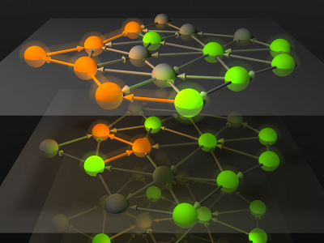

## Modeling static complex networks

Identifying universal structures in complex systems is a long standing challange in physics. In several cases one can assume, that the most important features of the system are idependent of positions in space and time. Instead, when the topological structure of the system plays an important role in understanding of the system, networks can be an effective representation an tool for modelling and simulating the main effects under study.

This project aims to survey the most common network scientific concepts. You can learn calculate, interpret and visualize some basic measure on networks, and generate ensemble models that are handy for estimate expected variances in real measurements.

We recommend for this project some software libraries:
* python [networkx](https://networkx.github.io/) 
* python [graph-tool](https://graph-tool.skewed.de/)
* python/R [igraph](http://igraph.org/) 
* C/C++ [lemon](https://lemon.cs.elte.hu/trac/lemon)
* awk-like [graphviz](http://www.graphviz.org/)

and some graphical softwares:
* [cytoscape](http://www.cytoscape.org)
* [gephi](http://www.gephi.org)
* [pajek](http://vlado.fmf.uni-lj.si/pub/networks/pajek/)
* [yED](http://www.yworks.com/en/products_yed_about.html)

Possible schedule for this project in weeks:
1. Install the above programs and libraries, familiarize your self with the basic commands: create a small network, update it, try to find effective data exchange methods between the tools.

2. Download networks of at least three different types from network repositories (see below). Find relationships between centrality measures, locate sample key elements (e.g. most important nodes or edges that can influence others, or nodes/edges that connect weakly connected subgraphs).

3. Find communities in networks with different algorithms! Compare their output, interpret the differences!

4. Construct hierarchical block models for your sample networks and visualize them in python and in the interactive softwares as well! Experiment with manual changes of the networks cytoscape, and create the corresponding block structure with graph-tool!

5. Generate network ensembles with rewiring of the links, keeping some global statistics (e.g. degree distribution) intact. What are the variances in other network measures?

6. Scale-free networks can be generated effectively on the Riemann surface. Repeat the results of the article by [Papadopoulos et al.](https://www.nature.com/articles/nature11459)! You will find helpful details in the supplementary material.

7. Generate an ensembe of networks that are very similar to a previously given network (e.g. from collected data)! Assume some noise in the original data and estimate the mean and variance of the network measures!

8. Generate an ensemble of networks and present the variances in the motifs statistics! Show some estimates about the reliability of the clusters (community structure) in networks that are constructed from noisy, uncertain data.

Bonus: 
* create network visualization in curved space (in the [planetarium](http://astro.elte.hu/))
* create interactive 3d visualization of your network with the [3D virtual reality lab](http://vc.elte.hu/)

Recommended literature:
* [Barabasi book](http://networksciencebook.com/)
* [Claudius Gros](http://th.physik.uni-frankfurt.de/~gros/Vorlesungen/CADS/): [Complex and Adaptive Dynamcial Systems, Springer; 1st ed.2008.](https://arxiv.org/pdf/0807.4838.pdf)
* [network literacy](https://sites.google.com/a/binghamton.edu/netscied/teaching-learning/network-concepts)
* [slides on graph spectra](http://www.slideshare.net/dgleich/the-spectre-of-the-spectrum)
* [hyperbolic embedding](https://www.nature.com/articles/nature11459) [free access](https://arxiv.org/abs/1106.0286)
* documentation and galleries of the software packages

Network repositories:
* [The Colorado Index of Complex Networks (ICON)](https://icon.colorado.edu/#!/)
* [brain, OpenConnectome](http://openconnecto.me/graph-services/download/)
* [movies, Netflix](http://academictorrents.com/details/9b13183dc4d60676b773c9e2cd6de5e5542cee9a)
* [Internet, DIMES](http://www.netdimes.org/new/)
* [Genomics, co-expression](https://en.wikipedia.org/wiki/Gene_co-expression_network) and [GEO](http://www.ncbi.nlm.nih.gov/geo/)
* [SNAP collection of networks](https://snap.stanford.edu/data/)

