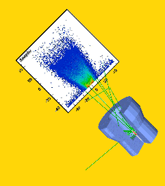

Nuclear and Particle Physics simulation software packages

GEANT4
Additional simulation programs that may be used: LISE, MCNP.

1. Installation  
Download from https://geant4.cern.ch,
then follow the installation description.
Set up the visualization properties.
Run to software using prepared input files. 

2. Run predefined settings  
getting to know the input and the running steps, 
getting to know the format of the results and using them, 
Making figures for the results, to reproduce a figure from a scientific
artice 

3. Changing Geometry  
The first unit of input is geometry. The aim is to change the detector
geometry in a pre-selected way, run the codes with a few new detector
geometries, interpret the resulting spectra, and select the defining
parameters  
Reproduce Figure 3 from the following publication:
https://www.researchgate.net/publication/271920760  
Specifying Detector Material  
Getting to know the format for specifying new materials in the detector, set
up a detector system using new materials. Run with new materials, analyze
the effects of individual small and large atomic numbers by analyzing
certain spectra of results

4. Physics list  
An overview of the options for choosing built-in physical processes.
Examining the detector you have made so far, if you allow more and more
physical processes. Constructing detectors in which different physical
processes play a major role. The interpretation of these spectra.

5. Run Action  
Setting the run parameters. Investigation of different energy, mixed energy
and different focusing featured beams in one and more detectors.
Characterization of the complete setting parameter space, setting all
parameters individually. Running with parameter sets and investigate the
response function.

6. Data analysis  
An overview of the options for evaluating data. So far, only the use of
spectrum-based assessment, the use of matches, statistical tests and
uncertainties are included in the simulation. Write simple data evaluation
macros.

7. Simulation of a HPGe detector  
Model a HPGe detector of the Lab of Deptartment of Atomic Physics by specifying the parameters of the detector. Calculate the response function of some high energy gamma sources.

8. Analysing the simulation results of the HPGe detector  
Analyse spectra from running the simulator. Compare results from different runs with variable parameters.

9. Calculate the efficiency of the HPGe  
Evaluate the photopeak and full efficiency of the detector at various energy levels and with different shadowing possibilities.

10. Create a runtime environment  
Create a user interface for batch processing or for evaluating large number of simulations. The interface should allow simulations with several options and methods. The evaluation of data should be automatic even for complex tasks.
