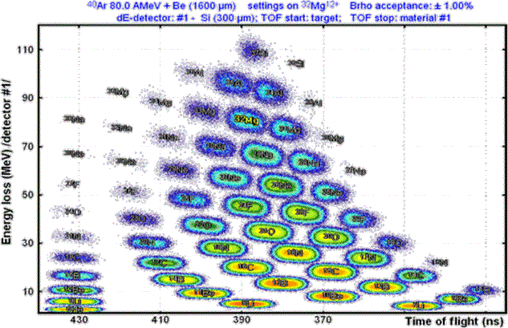

Nuclear and Particle Physics simulation software packages II.

LISE++

1. Installation

Download from http://lise.nscl.msu.edu/lise.html,
then follow the installation description.
Set up the visualization properties.
Run to software using prepared input files. 

2. Run predefined settings

Getting to know the input and the running steps, 
getting to know the format of the results and using them, 
Making figures for the results, to reproduce a figure from a scientific
artice 

3. Changing Geometry

The first unit of input is geometry. The aim is to change the detector
geometry in a pre-selected way, run the codes with a few new detector
geometries, interpret the resulting spectra, and select the defining
parameters

Reproduce Figure 3 from the following publication:
https://www.researchgate.net/publication/271920760

4. Specifying Detector Material

Getting to know the format for specifying new materials in the detector, set
up a detector system using new materials. Run with new materials, analyze
the effects of individual small and large atomic numbers by analyzing
certain spectra of results

5. Physics list

An overview of the options for choosing built-in physical processes.
Examining the detector you have made so far, if you allow more and more
physical processes. Constructing detectors in which different physical
processes play a major role. The interpretation of these spectra.

6. Run Action

Setting the run parameters. Investigation of different energy, mixed energy
and different focusing featured beams in one and more detectors.
Characterization of the complete setting parameter space, setting all
parameters individually. Running with parameter sets and investigate the
response function.

7. Data analysis

An overview of the options for evaluating data. So far, only the use of
spectrum-based assessment, the use of matches, statistical tests and
uncertainties are included in the simulation. Write simple data evaluation
macros.

8. Simulation of a complex detector system

Download and paste a public input file of one of the detector systems of a
high accelerators (NSCL, RIKEN, CERN, GSI) into the simulation environment.
Determining the response function of some beams. Investigation of multiple
detector energy outputs of neutrons as a function of energy, determination
of detector acceptance for different settings. Examining the emergence of
secondary processes by changing the settings of the physics list parameters.

9. Evaluation of complex detector system data

Developing Models to Evaluate Run Results.

10. Constructing run interfaces

Creating a sequentially running frame or interface that can run the
simulation in several ways in succession, and data evaluation is done
automatically, can answer complex questions.

